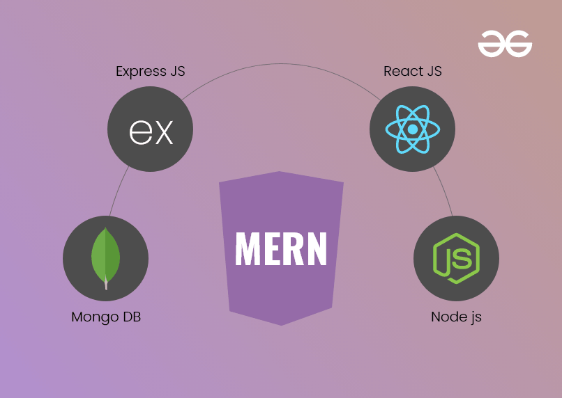

# Preparing Prerequisites

# Introduction

The MERN (MongoDB, Express, React, Node.js) web stack is a popular tech stack for building web applications. Here's a brief overview of each component and how they work together:

1. MongoDB: MongoDB is a NoSQL database that stores data in JSON-like documents. It's a flexible, scalable, and high-performance database that allows for easy data modeling and supports a wide range of use cases.

2. Express: Express is a Node.js web application framework that provides a robust set of features for building web applications, including routing, middleware, and template engines. It's lightweight, fast, and flexible, making it a popular choice for building web applications.

3. React: React is a front-end JavaScript library for building user interfaces. It's designed to be fast, efficient, and easy to use, and it allows developers to create reusable UI components that can be used to build complex, interactive user interfaces.

4. Node.js: Node.js is a server-side JavaScript runtime that allows developers to run JavaScript on the server. It's event-driven, non-blocking I/O model makes it lightweight and efficient, and it's a popular choice for building real-time web applications.

The MERN stack is often used together to build web applications because it allows developers to use the same language (JavaScript) for both the front-end and back-end, which can streamline development and make it easier to maintain and update the application.

