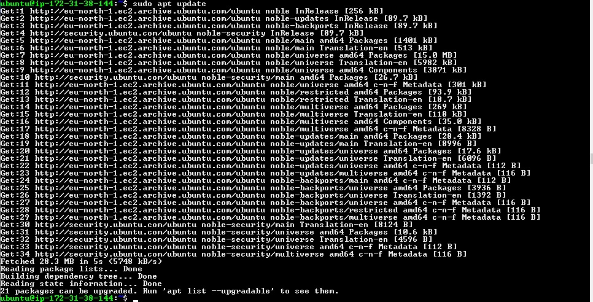
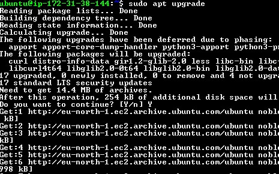
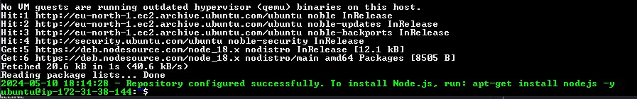
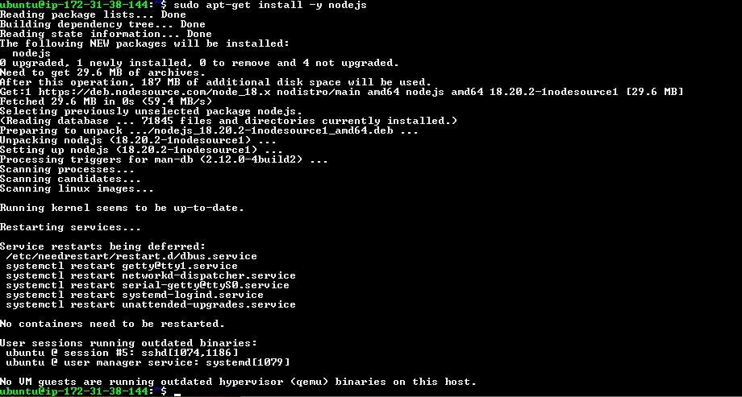
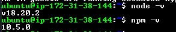
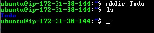
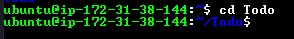
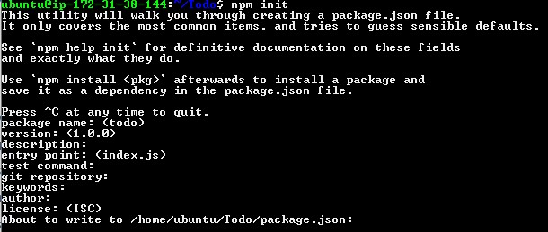
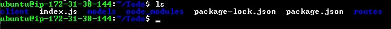

# Backend Configuration

Update ubuntu

```
sudo apt update
```



Upgrade ubuntu

```
sudo apt upgrade
```



Get the location of Node.js software from ubuntu repositories.

```
curl -fsSL https://deb.nodesource.com/setup_18.x | sudo -E bash -
```



Install node.js and NPM

```
sudo apt-get install -y nodejs
```



Verify installation

```
node -v
npm -v
```



Let's create a new directory for our **TO-Do** project

```
mkdir Todo
```



Now, we change our current directory to the newly created one

```
cd Todo
```



Then `npm init` and `ls` to confirm your package.json is installed



