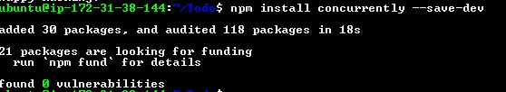
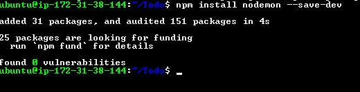
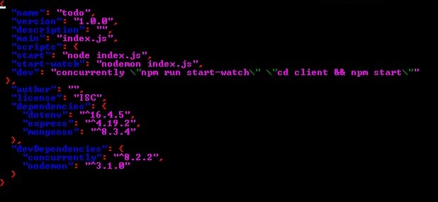
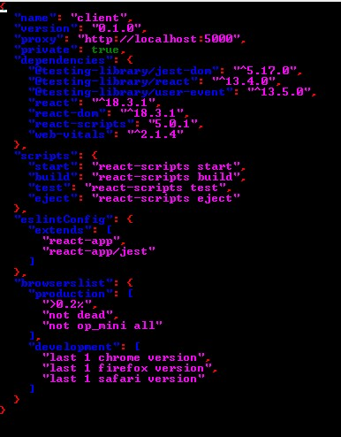
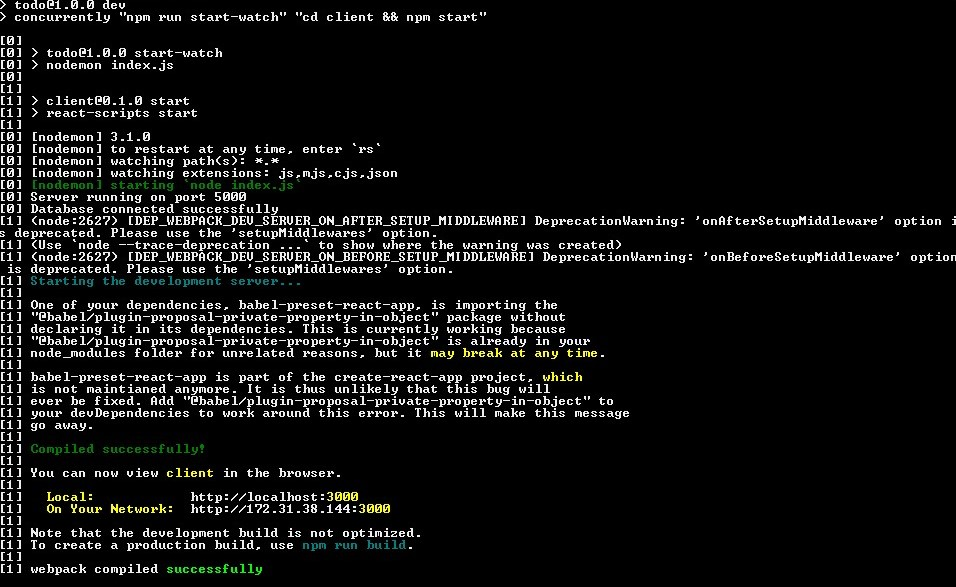

# Frontend Creation

In the Todo directory, run

```
npx create-react-app client
```


Install concurrently

```
npm install concurrently --save-dev
```



install nodemon

```
npm install nodemon --save-dev
```



Open package.json file

```
sudo nano package.json
```

paste

```
{
  "name": "todo",
  "version": "1.0.0",
  "description": "",
  "main": "index.js",
  "scripts": {
  "start": "node index.js",
  "start-watch": "nodemon index.js",
  "dev": "concurrently \"npm run start-watch\" \"cd client && npm start\""
 },
  "author": "",
  "license": "ISC",
  "dependencies": {
    "dotenv": "^16.4.5",
    "express": "^4.19.2",
    "mongoose": "^8.3.4"
  },
  "devDependencies": {
    "concurrently": "^8.2.2",
    "nodemon": "^3.1.0"
  }
}
```



change directory to client, open package.json and add `“proxy”: “http://localhost:5000”`



then back to Todo `npm run dev`



before we test it in the browser let's update the inbound rules of the EC2 instance to allow traffic on port 3000. we will be running the frontend server on port 3000.

Note: In order to access the application from the internet, TCP port 3000 had been opened on EC2.
