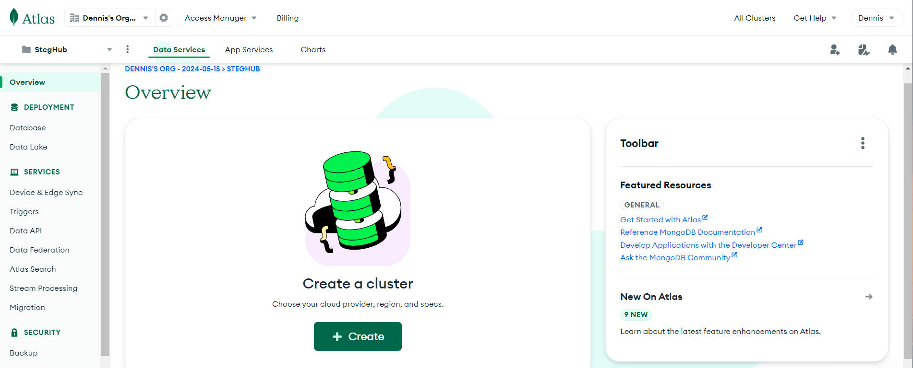
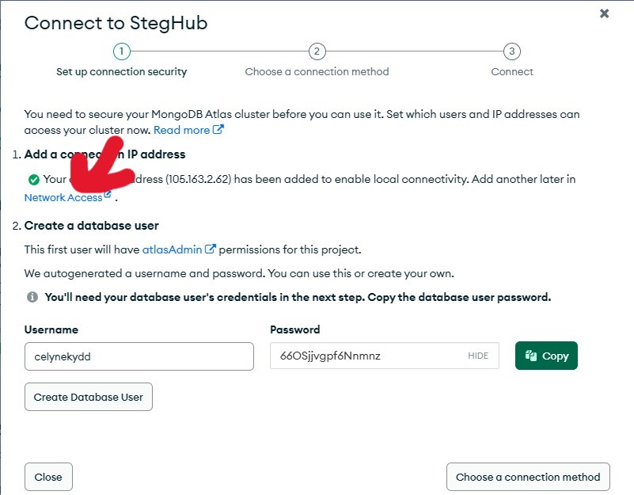
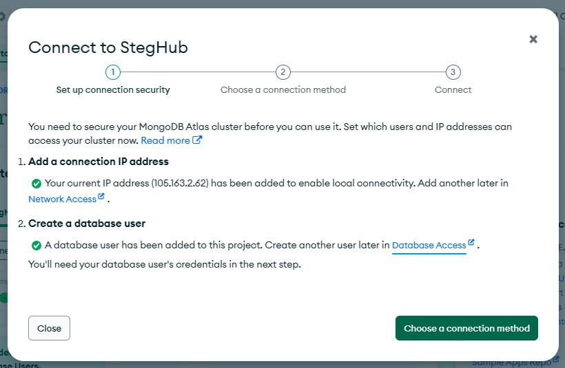
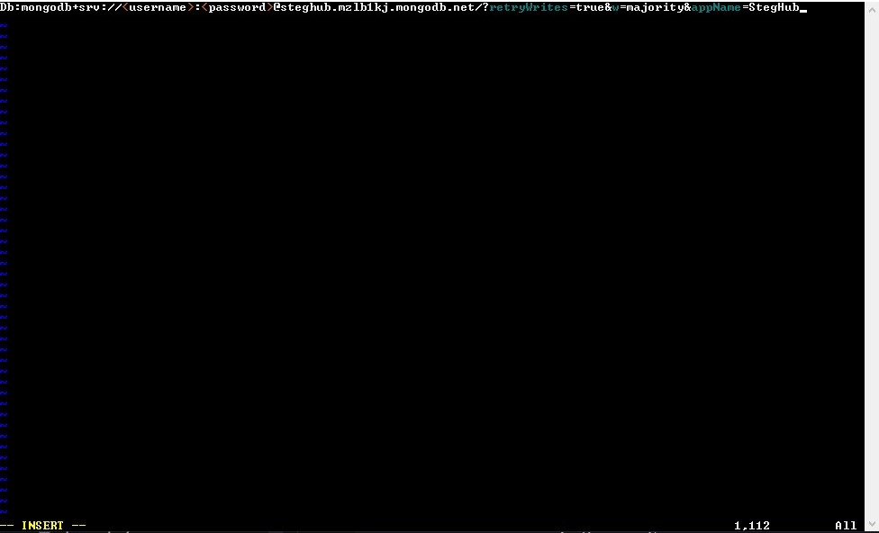

# MongoDB Database

First, we need an mLab account


After sign up, click on Create a project button then inside the project, click create Cluster button




It'll bring us to the Deploy your clusture page, Choose the free version, add a name, AWS cloud and then region closest to you then create deployment


Click connect clusture, then network access



Change IP address to anywhere


Create a database user




Create a Database User by going to the “Database Access” under the “Security” section.
Click on “Add New Database User”.


Enter a username and password. Ensure the “Read and Write to any database” option is selected.
Click "Add User".


Then go back to overview page, click in connect, select drivers and choose Mongoose , copy your conection url, click done.


Next, we create a file in our Todo and name it `.env`

```
touch .env
vi .env
```

we paste in our connection string

```
DB:mongodb+srv://<username>:<password>@steghub.mzlb1kj.mongodb.net/?retryWrites=true&w=majority&appName=StegHub
```



Navigate to the index.js file which i already set up,

     vim index.js

Clear out previous code and paste this sample :

```
       const express = require('express');
       const bodyParser = require('body-parser');
       const mongoose = require('mongoose');
       const routes = require('./routes/api');
       const path = require('path');
       require('dotenv').config();

       const app = express();

       const port = process.env.PORT || 5000;

       //connect to the database
      mongoose.connect(process.env.DB)
     .then(() => console.log('Database connected successfully'))
     .catch(err => console.log('Error connecting to MongoDB:', err));


       //since mongoose promise is depreciated, we overide it with node's promise
       mongoose.Promise = global.Promise;

       app.use((req, res, next) => {
       res.header("Access-Control-Allow-Origin", "\*");
       res.header("Access-Control-Allow-Headers", "Origin, X-Requested-With, Content-Type, Accept");
       next();
       });

       app.use(bodyParser.json());

       app.use('/api', routes);

       app.use((err, req, res, next) =>  {
       console.log(err);
       next();
       });

       app.listen(port, () =>  {
       console.log(`Server running on port ${port}`)
       });
```


Start the server `node index.js`  
You shall see a message "Database connected succesfully"


