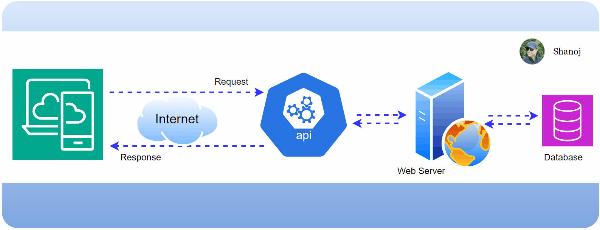
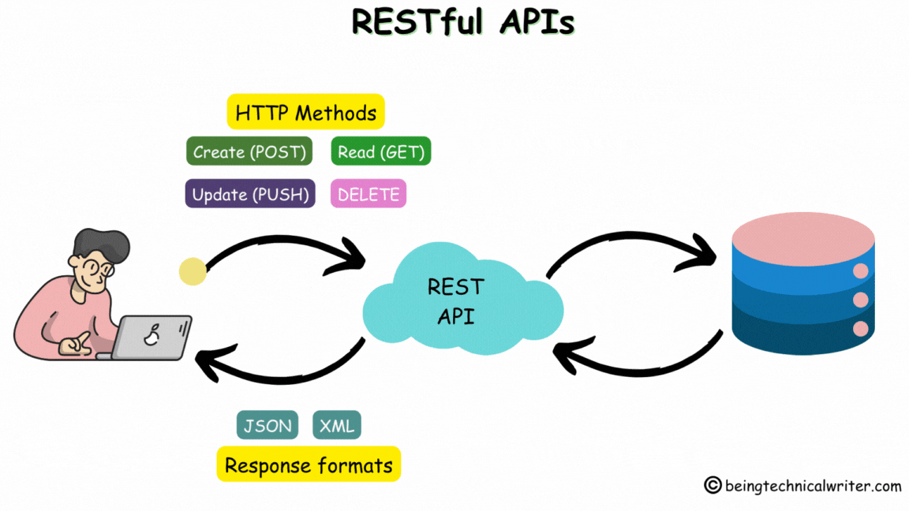

# Restful API

A RESTful API (or REST API) is a software interface that follows a set of guidelines for how applications request and exchange information over the internet. It's a popular way for web services to communicate with each other in a standardized and interoperable manner.

* REST (Representational State Transfer): REST is an architectural style, not a specific protocol. It defines principles for creating scalable web services.
* APIs (Application Programming Interfaces): APIs are intermediaries that allow different applications to communicate with each other. RESTful APIs adhere to specific design rules to ensure consistent communication.

Imagine a RESTful API as a way to access resources on a server, like a library catalogue.  Here's a simplified analogy:

* Client (like you): You want to borrow a book (information) from the library (server).
* Request: You make a request to the librarian (API) specifying the title (resource) you want. You use standard methods like GET (to retrieve), PUT (to update), POST (to create), and DELETE (to remove) data.
* Resource: The resource you request could be anything from a product in an online store to a blog post on a website. It's identified by a URL.
* Response: The librarian retrieves the book and gives it to you (sends the data). The response includes a status code indicating success (e.g., 200 OK) or error (e.g., 404 Not Found).

Restful API uses HTTP protocol to communicate between the client and server. The client can be a web browser, a mobile app, or another server.  
The server is responsible for managing the resources and responding to the client's requests.

Restful API has several advantages in web development, including:

- Platform independence: Restful API can be built using any programming language or framework, making it platform-independent.

- Interoperability: Restful API can be easily integrated with other systems, making it a popular choice for building web services.

- Scalability: Restful API is designed to scale horizontally, making it suitable for high-traffic applications.

- Flexibility: Restful API allows for a wide range of data formats, such as JSON, XML, and HTML, making it flexible and adaptable to different client needs.

- Security: Restful API uses HTTPS protocol, which provides secure communication between the client and server.

They is widely used in web development for building:

1. Web services: Restful API is used to build web services that can be easily integrated with other systems.

2. APIs: Restful API is used to build APIs that can be used by developers to build applications.
   Microservices: Restful API is used to build microservices that can be used to build distributed systems.

3. Cloud services: Restful API is used to build cloud services that can be easily integrated with other systems.

4. Mobile applications: Restful API is used to build mobile applications that can communicate with the server using HTTP protocol.
