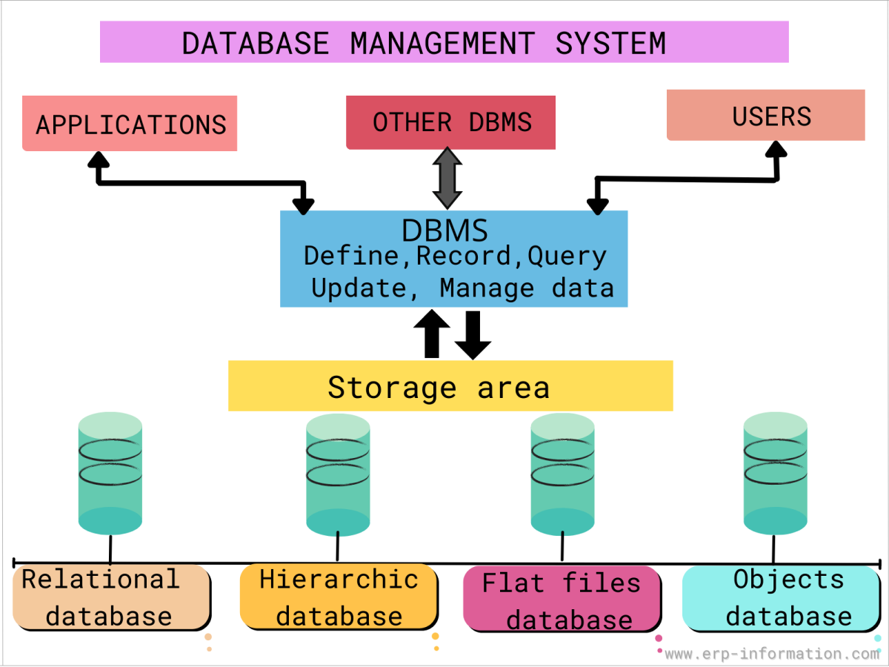
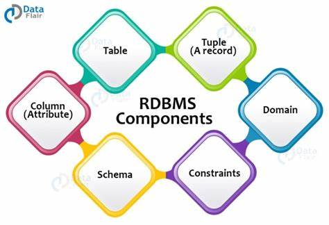
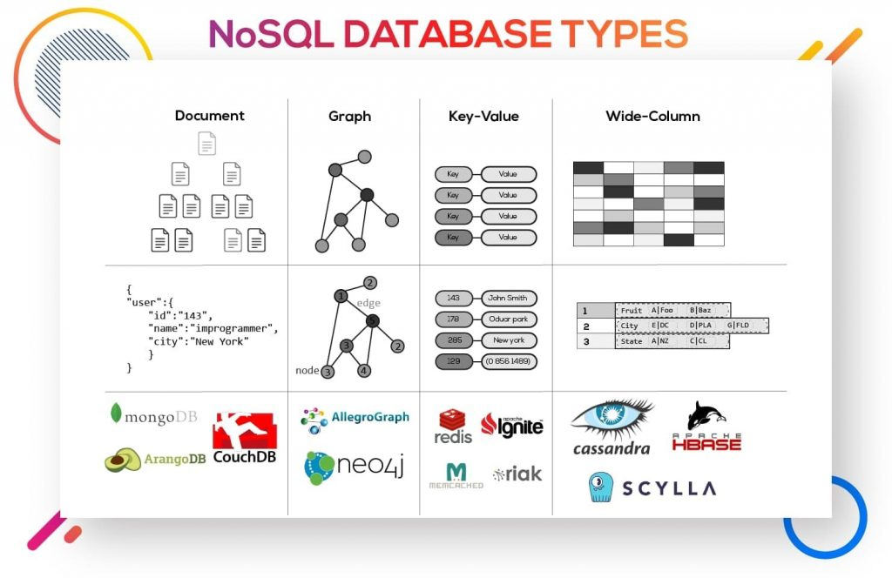
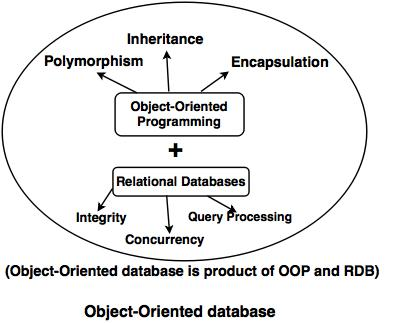
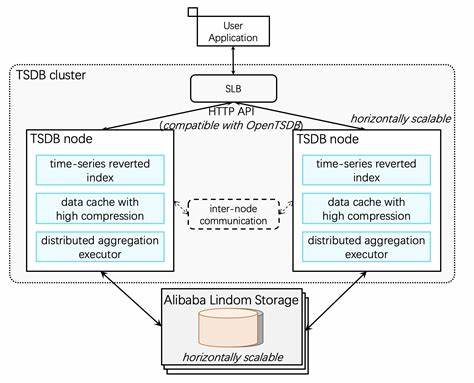
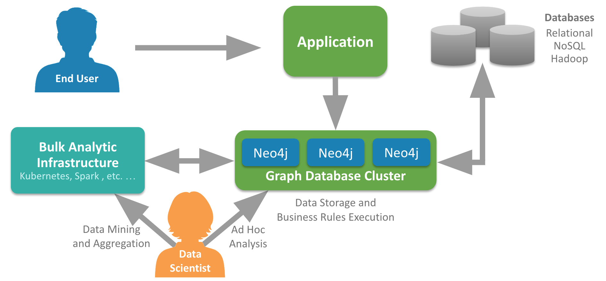

# Database Management Systems

There are several database management systems (DBMS) available, each catering to specific data storage and retrieval needs. Here's a breakdown of some common types and their strengths:

Below are some of the most common types of DBMS i have found:

## Relational Database Management System (RDBMS)

RDBMS is the most traditional type of DBMS.  
It stores data in tables with rows and columns, and relationships between tables are defined using foreign keys.

* Structure: Stores data in tables with rows and columns. Enforces relationships between tables using keys.
* Suitable for: Wide variety of applications, from small business to large enterprises. Ideal for structured data with well-defined relationships.
* Examples: MySQL, PostgreSQL, Microsoft SQL Server, Oracle Database.

## NoSQL Database Management System

NoSQL is a type of database management system (DBMS) that is designed to handle and store large volumes of unstructured and semi-structured data. Unlike traditional relational databases that use tables with pre-defined schemas to store data, NoSQL databases use flexible data models that can adapt to changes in data structures and are capable of scaling horizontally to handle growing amounts of data. NoSQL originally referring to non SQL or non relational is a database that provides a mechanism for storage and retrieval of data. This data is modeled in means other than the tabular relations used in relational databases.

Examples of NoSQL DBMS include

- MongoDB
- Cassandra
- Redis
- Riak.

### Disadvantages of NoSQL: NoSQL has the following disadvantages.

* Lack of standardization:  There are many different types of NoSQL databases, each with its own unique strengths and weaknesses. This lack of standardization can make it difficult to choose the right database for a specific application
* Lack of ACID compliance: NoSQL databases are not fully ACID-compliant, which means that they do not guarantee the consistency, integrity, and durability of data. This can be a drawback for applications that require strong data consistency guarantees.
* Narrow focus: NoSQL databases have a very narrow focus as it is mainly designed for storage but it provides very little functionality. Relational databases are a better choice in the field of Transaction Management than NoSQL.
* Open-source: NoSQL is an databaseopen-source database. There is no reliable standard for NoSQL yet. In other words, two database systems are likely to be unequal.
* Lack of support for complex queries: NoSQL databases are not designed to handle complex queries, which means that they are not a good fit for applications that require complex data analysis or reporting.
* Lack of maturity: NoSQL databases are relatively new and lack the maturity of traditional relational databases. This can make them less reliable and less secure than traditional databases.
* Management challenge: The purpose of big data tools is to make the management of a large amount of data as simple as possible. But it is not so easy. Data management in NoSQL is much more complex than in a relational database. NoSQL, in particular, has a reputation for being challenging to install and even more hectic to manage on a daily basis.
* Large document size: Some database systems like MongoDB and CouchDB store data in JSON format. This means that documents are quite large (BigData, network bandwidth, speed), and having descriptive key names actually hurts since they increase the document size.

### When should NoSQL be used:

* When a huge amount of data needs to be stored and retrieved.
* The relationship between the data you store is not that important
* The data changes over time and is not structured.
Support of Constraints and Joins is not required at the database level
* The data is growing continuously and you need to scale the database regularly to handle the data.

## Object-Oriented Database Management System (OODBMS):

OODBMS is a type of DBMS that stores data in the form of objects, which are instances of classes that represent real-world entities.

Examples of OODBMS include

- Gemstone
- Matisse
- ObjectDB

* Structure: Stores data in objects that encapsulate data and operations on that data, similar to object-oriented programming concepts.
* Suitable for: Complex data structures like engineering applications or multimedia applications where data has inherent functionalities.
* Examples: GemStone, ObjectStore (Less common than RDBMS).

## Time-Series Database Management System (TSDBMS)

A time series database (TSDB) is a specialized type of database optimized for handling time-stamped or time series data.
TSDBMS are designed to handle time-stamped data and provide low-latency data access, high ingestion rates, and support for real-time analytics. They are ideal for applications that require real-time insights into time-stamped data, such as IoT data storage and analysis, financial data storage and analysis, healthcare data storage and analysis, energy and utilities data storage and analysis, and transportation data storage and analysis.

Examples of TSDBMS include

- InfluxDB
- OpenTSDB
- TimescaleDB.

### Key Characteristics of TSDBs:
- Optimized for Time-Stamped Data: TSDBs are designed specifically for handling metrics and events with timestamps.
- Data Lifecycle Management: They handle data changes over time, including summarization and aggregation.
- Large Range Scans: Efficiently scan and retrieve many records within a given time range.

 - Compared to relational or NoSQL databases, time series databases are more difficult to set up and maintain.
-  There are fewer time series databases to pick from, which limits your options for finding a platform that satisfies your particular requirements.
- Time series analysis provides a probability value on potential future outcomes rather than the actual project value.
  
## Graph Database Management System (GDBMS)

Graph databases are NoSQL systems created for exploring correlation within complexly interconnected entities. The structure addresses the limitations found in relational databases by putting a greater accent on the data relationship.

The graph database approach allows for more leisurely interconnection exploration, providing answers to complex questions about how data points relate to each other.

Examples of GDBMS include

- Neo4j
- Amazon Neptune
- OrientDB.

Pros:

* Real-Time Recommendation Engines. Real-time product and ecommerce recommendations provide a better user experience while maximizing profitability. Notable cases include Netflix, eBay, and Walmart.
* Master Data Management. Linking all company data to one location for a single point of reference provides data consistency and accuracy. Master data management is crucial for large-scale global companies.
* GDPR and regulation compliances. Graphs make tracking of data movement and security easier to manage. The databases reduce the potential of data breaches and provide better consistency when removing data, improving the overall trust with sensitive information.
* Digital asset management. The amount of digital content is massive and constantly increasing. Graph databases provide a scalable and straightforward database model to keep track of digital assets, such as documents, evaluations, contracts, etc.
* Context-aware services. Graphs help provide services related to actual-world characteristics. Whether it is natural disaster warnings, traffic updates, or product recommendations for a given location, graph databases offer a logical solution to real-life circumstances.
* Fraud detection. Finding suspicious patterns and uncovering fraudulent payment transactions is done in real-time using graph databases. Targeting and isolating parts of graphs provide quicker detection of deceptive behavior.

Cons:

* There is no standardized query language. The language depends on the platform used.
* Graphs are inappropriate for transactional-based systems.
The user-base is small, making it hard to find support when running into a problem.

## Document Database Management System (DDBMS)

A Document Data Model is a lot different than other data models because it stores data in JSON, BSON, or XML documents. in this data model, we can move documents under one document and apart from this, any particular elements can be indexed to run queries faster. Often documents are stored and retrieved in such a way that it becomes close to the data objects which are used in many applications which means very less translations are required to use data in applications. JSON is a native language that is often used to store and query data too. 

.jpg>)

Examples of DDBMS include

- MongoDB
- Couchbase
- RavenDB

Pros:

* Schema-less: These are very good in retaining existing data at massive volumes because there are absolutely no restrictions in the format and the structure of data storage. 
  
* Faster creation of document and maintenance: It is very simple to create a document and apart from this maintenance requires is almost nothing.
  
* Open formats: It has a very simple build process that uses XML, JSON, and its other forms.
  
* Built-in versioning: It has built-in versioning which means as the documents grow in size there might be a chance they can grow in complexity. Versioning decreases conflicts.

Cons:

* Weak Atomicity: It lacks in supporting multi-document ACID transactions. A change in the document data model involving two collections will require us to run two separate queries i.e. one for each collection. This is where it breaks atomicity requirements.
  
* Consistency Check Limitations: One can search the collections and documents that are not connected to an author collection but doing this might create a problem in the performance of database performance.

 - Security: Nowadays many web applications lack security which in turn results in the leakage of sensitive data. So it becomes a point of concern, one must pay attention to web app vulnerabilities.